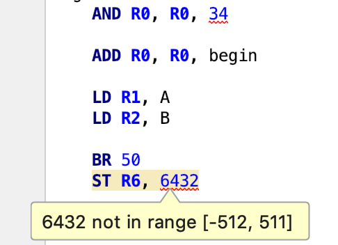

# IntelliJ LC-3 Plugin

## Install

This plugin is still in development. The latest version can be found in [GitHub Releases](https://github.com/Pear0/lc3-intelliJ/releases).

## Features

### Probably Dead Code Analysis 

### Calling Convention Checking (see below)

### Stack / Register Tracing (see below)

### Syntax Highlighting

### Memory Address Gutter

### Label Completion

### Range Checks

## Code Tracing Analysis

A pragma can be used to enable symbolic execution analysis for a function.
This is necessary for calling convention verification and the tracing sidebar 
to work. 

The symbolic execution analysis is detailed more [here](Flow%20Analysis.md).

## Credits

The idea and original plugin are thanks to [Codetector](https://github.com/Codetector1374).

Contributors:
* [Will Gulian](https://github.com/Pear0)
* [Codetector](https://github.com/Codetector1374)
